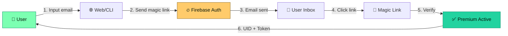

```markdown
<!-- ═══════════════════════════════════════════════════════════════════════
     OMNI AZURE ASAHIRO · README
     Team Reverse Neo · ansari × zenno
     ═══════════════════════════════════════════════════════════════════════ -->

<div align="center">

<!-- ─── LOGO & TITLE ─── -->
<a href="https://am.neonode.my.id">
  
</a>

<br><br>

# ⚡ OMNI AZURE ASAHIRO

### *The Ultimate All-in-One Creative Toolkit*

**Alight Motion Activator · CapCut Templates · Web to APK · YouTube Music · AI Image Gen**

<br>

<!-- ─── STATUS BADGES ─── -->
<p>
  
  
  
  
</p>

<p>
  
  
  
  
  
</p>

<br>

<!-- ─── CTA BUTTONS ─── -->
<a href="https://am.neonode.my.id">
  
</a>
&nbsp;
<a href="https://whatsapp.com/channel/0029VbDz1xsEQIau8FQEtF16">
  
</a>

<br><br>

<!-- ─── BYLINE ─── -->
**🖤 Made with love by** &nbsp; `team reverse — neo`
**👤** ansari &nbsp;·&nbsp; **👤** zenno

<br>

<!-- ─── TABLE OF CONTENTS ─── -->
<details open>
<summary><b>📑 Table of Contents (click to expand)</b></summary>
<br>

**🎯 Getting Started**
- [✨ Highlight](#-highlight)
- [🎁 Feature Matrix](#-feature-matrix)
- [🚀 Quick Start](#-quick-start)

**🛠️ Tools & Features**
- [🎯 Alight Motion Activator](#-alight-motion-activator)
- [🎬 CapCut Templates](#-capcut-templates)
- [📦 Web to APK Builder](#-web-to-apk-builder)
- [🎵 YouTube Music Player](#-youtube-music-player)
- [🎨 AI Image Generator](#-ai-image-generator)
- [📬 Inbox Viewer](#-inbox-viewer)
- [🖥️ Terminal Log](#%EF%B8%8F-terminal-log)

**📚 Documentation**
- [📁 Project Structure](#-project-structure)
- [🔌 API Reference](#-api-reference)
- [🛠️ Environment](#%EF%B8%8F-environment)
- [🌐 Deployment Guide](#-deployment-guide)
- [⌨️ Keyboard Shortcuts](#%EF%B8%8F-keyboard-shortcuts)

**ℹ️ More Info**
- [🔒 Security & Privacy](#-security--privacy)
- [🐛 Troubleshooting](#-troubleshooting)
- [📜 Changelog](#-changelog)
- [🗺️ Roadmap](#%EF%B8%8F-roadmap)
- [🤝 Contributing](#-contributing)
- [🙏 Credits](#-credits)
- [⚠️ Disclaimer](#%EF%B8%8F-disclaimer)

</details>

</div>

<br>

---

<div align="center">

## ⚠️ IMPORTANT NOTICE

<table>
<tr>
<td align="center">

### 🚨 **THIS IS UNOFFICIAL SOFTWARE** 🚨

**NOT** affiliated with **Alight Creative**, **Google**, **CapCut**, or **YouTube**.

Built from scratch through **deep reverse engineering** of:
- 📡 Android app traffic (sniffed)
- 🔐 Firebase Auth protocol (decoded)
- 💳 `verifyPurchase` endpoint (analyzed)

**If your account gets banned — that's on you.**

</td>
</tr>
</table>

</div>

---

## ✨ Highlight

<div align="center">

### 🎯 **Six powerful tools in one sleek web app**

<br>

<table>
<tr>
<td align="center" width="33%">

### 🎯
### **AM Premium**
**Alight Motion Activator**

<span style="color: #7cffb2;">━━━━━━━━━━━━━</span>

Turn your free account
into premium for **FREE**

<sub>`magic link` · `auto-verify`</sub>

</td>
<td align="center" width="33%">

### 🎬
### **CapCut**
**Template Search**

<span style="color: #ffcb6b;">━━━━━━━━━━━━━</span>

Find viral templates
for your video edits

<sub>`video` · `image` · `proxy`</sub>

</td>
<td align="center" width="33%">

### 📦
### **Web to APK**
**APK Builder**

<span style="color: #b48bff;">━━━━━━━━━━━━━</span>

Convert any website
into Android app

<sub>`custom icon` · `5x retry`</sub>

</td>
</tr>
<tr>
<td align="center" width="33%">

### 🎵
### **YouTube Music**
**Audio Streaming**

<span style="color: #6bb8ff;">━━━━━━━━━━━━━</span>

Search & stream any song
directly in browser

<sub>`search` · `play` · `download`</sub>

</td>
<td align="center" width="33%">

### 🎨
### **AI Image**
**Text to Image**

<span style="color: #ff6b9d;">━━━━━━━━━━━━━</span>

Generate stunning images
from text prompts

<sub>`5 presets` · `negative prompt`</sub>

</td>
<td align="center" width="33%">

### 📬
### **Inbox**
**Email Viewer**

<span style="color: #22d3a0;">━━━━━━━━━━━━━</span>

Check incoming emails
in real-time

<sub>`auto-refresh` · `XSS-safe`</sub>

</td>
</tr>
</table>

</div>

<br>

### 🌟 Why Choose Omni Azure Asahiro?

<table>
<tr>
<td width="50%">

**✅ What We Offer**

- 🆓 **100% Free Forever** — no ads, no subscription, no limits
- 🔒 **Privacy First** — no analytics, no cookies, no fingerprint
- ⚡ **Blazing Fast** — proxy rotation with 5× auto-retry
- 🎨 **Premium UI** — glassmorphism, aurora, particles, confetti
- 🖥️ **Live Terminal** — real-time colored logging
- 🌐 **Mobile-First** — perfect on all screen sizes
- 🔐 **Stealth Mode** — mimics real Android app headers
- 🌙 **Dark Theme** — easy on the eyes

</td>
<td width="50%">

**❌ What We Don't Do**

- ❌ Track your activity
- ❌ Store your data
- ❌ Sell your info
- ❌ Show intrusive ads
- ❌ Require sign-up
- ❌ Limit your usage
- ❌ Break on mobile
- ❌ Nag you with popups

</td>
</tr>
</table>

---

## 🎁 Feature Matrix

<table>
<thead>
<tr>
<th align="left">Feature</th>
<th align="center">Web</th>
<th align="center">CLI</th>
<th align="center">Status</th>
</tr>
</thead>
<tbody>
<tr>
<td>🔐 <b>Magic Link Login</b></td>
<td align="center">✅</td>
<td align="center">✅</td>
<td align="center">🟢 Stable</td>
</tr>
<tr>
<td>⚡ <b>Premium Auto-Activate</b></td>
<td align="center">✅</td>
<td align="center">✅</td>
<td align="center">🟢 Stable</td>
</tr>
<tr>
<td>🔄 <b>Auto Refresh Token</b></td>
<td align="center">✅</td>
<td align="center">✅</td>
<td align="center">🟢 Stable</td>
</tr>
<tr>
<td>📧 <b>Generate Random Email</b></td>
<td align="center">✅</td>
<td align="center">❌</td>
<td align="center">🟢 Stable</td>
</tr>
<tr>
<td>📬 <b>Inbox Viewer</b></td>
<td align="center">✅</td>
<td align="center">❌</td>
<td align="center">🟢 Stable</td>
</tr>
<tr>
<td>⚡ <b>Auto-Verify Link</b></td>
<td align="center">✅</td>
<td align="center">❌</td>
<td align="center">🟢 Stable</td>
</tr>
<tr>
<td>🎬 <b>CapCut Templates</b></td>
<td align="center">✅</td>
<td align="center">❌</td>
<td align="center">🟢 Stable</td>
</tr>
<tr>
<td>📦 <b>Web to APK Builder</b></td>
<td align="center">✅</td>
<td align="center">❌</td>
<td align="center">🟢 Stable</td>
</tr>
<tr>
<td>🎵 <b>YouTube Music</b></td>
<td align="center">✅</td>
<td align="center">❌</td>
<td align="center">🟢 Stable</td>
</tr>
<tr>
<td>🎨 <b>AI Image Generator</b></td>
<td align="center">✅</td>
<td align="center">❌</td>
<td align="center">🟢 Stable</td>
</tr>
<tr>
<td>🖥️ <b>Terminal Log</b></td>
<td align="center">✅</td>
<td align="center">✅</td>
<td align="center">🟢 Stable</td>
</tr>
<tr>
<td>💾 <b>History (LocalStorage)</b></td>
<td align="center">✅</td>
<td align="center">✅</td>
<td align="center">🟢 Stable</td>
</tr>
<tr>
<td>🔊 <b>Sound FX</b></td>
<td align="center">✅</td>
<td align="center">❌</td>
<td align="center">🟢 Stable</td>
</tr>
<tr>
<td>🎊 <b>Confetti Animation</b></td>
<td align="center">✅</td>
<td align="center">❌</td>
<td align="center">🟢 Stable</td>
</tr>
<tr>
<td>⌨️ <b>Keyboard Shortcuts</b></td>
<td align="center">✅</td>
<td align="center">❌</td>
<td align="center">🟢 Stable</td>
</tr>
</tbody>
</table>

---

## 🚀 Quick Start

<table>
<tr>
<td>

### 📦 **1. Clone Repository**

</td>
</tr>
</table>

```bash
git clone https://github.com/username/am-neo.git
cd am-neo
```

<table>
<tr>
<td>

📥 2. Install Dependencies

</td>
</tr>
</table>

```bash
npm install
```

<table>
<tr>
<td>

⚙️ 3. Run The App

</td>
</tr>
</table>

<table>
<tr>
<td width="50%">

🌐 Web Mode

```bash
node server.js
```

Server starts at:

```
http://localhost:3300
```

</td>
<td width="50%">

💻 CLI Mode

```bash
node am.js
```

Interactive menu:

```
1. Kirim magic link
2. Verifikasi link
3. Aktivasi ulang
4. Lihat sesi
```

</td>
</tr>
</table>

<table>
<tr>
<td>

🌐 4. Open In Browser

</td>
</tr>
</table>

```
┌────────────────────────────────────────────┐
│  🎯 Omni Azure Asahiro v7.3.0             │
├────────────────────────────────────────────┤
│                                            │
│  Step 1  📧  Masukkan Email               │
│  ├─ Email Pribadi                          │
│  └─ Email Random (generate otomatis)       │
│                                            │
│  Step 2  🔗  Verifikasi Link              │
│  └─ Paste magic link / auto-verify         │
│                                            │
│  Step 3  ✅  Premium Aktif!                │
│  └─ UID + ID Token muncul                  │
│                                            │
└────────────────────────────────────────────┘
```

---

🎯 Alight Motion Activator

Inti dari aplikasi ini — aktivasi premium Alight Motion secara gratis

🎬 How It Works



✨ Fitur Utama

<table>
<tr>
<td width="50%">

🔐 Magic Link Login

· Masuk pake email doang
· Tanpa password
· Tanpa akun Google
· Firebase Auth magic link

⚡ Premium Auto-Activate

· Setelah verifikasi, premium langsung nempel
· UID otomatis tersimpan
· ID Token di-cache
· Order ID unik per aktivasi

</td>
<td width="50%">

📧 Multi Email Mode

· Email Pribadi — pakai email kamu sendiri
· Email Random — generate dari 4+ domain duckzmail
· Auto-copy email ke clipboard

🕵️ Stealth Headers

```
x-android-package: com.alightcreative.motion
x-android-cert: <SHA1>
user-agent: AlightMotion/...
```

</td>
</tr>
</table>

---

🎬 CapCut Templates

Cari template CapCut viral langsung dari web

🔍 Features

<table>
<tr>
<td>

Feature Description
🔎 Search by Keyword Video & Image tabs
🖼️ Rich Preview Cover, duration, use count, like count
🔗 Use Template Open directly in CapCut
📋 Copy Link One-click copy
🛡️ Proxy Rotation 5× auto-retry, anti rate-limit
🌐 CORS Fallback Backend → AllOrigins → Codetabs

</td>
</tr>
</table>

📡 API Example

```bash
curl -X POST http://localhost:3300/api/capcut-search \
  -H "Content-Type: application/json" \
  -d '{
    "keyword": "aesthetic",
    "tabs": ["video"],
    "size": 20
  }'
```

📊 Response

```json
{
  "success": true,
  "message": "Found 20 templates for \"aesthetic\"",
  "data": {
    "keyword": "aesthetic",
    "total_results": 20,
    "templates": [
      {
        "templateId": "...",
        "title": "Aesthetic Vibes",
        "useCount": 12345,
        "likeCount": 6789,
        "templateDuration": 15,
        "coverUrl": "https://...",
        "videoUrl": "https://...",
        "fragmentId": "..."
      }
    ],
    "proxy_ip": "1.2.3.4",
    "timestamp": "2025-01-01T00:00:00.000Z"
  }
}
```

---

📦 Web to APK Builder

Convert any website into Android app

🎯 Configuration

<table>
<tr>
<td width="50%">

📝 Required Fields

Field Example
🌐 Website URL https://example.com
📱 App Name MyAwesomeApp
📦 Package Name com.example.myapp

</td>
<td width="50%">

⚙️ Optional Fields

Field Options
🖼️ Icon URL Any image URL
🔢 Version Name 1.0
🔢 Version Code 1
📐 Orientation Auto/Portrait/Landscape
✨ Splash Type Image/Text

</td>
</tr>
</table>

🚀 Build Progress

```
┌──────────────────────────────────────────┐
│  Building APK...                   45%   │
│  ████████████████░░░░░░░░░░░░░░░░░░░     │
├──────────────────────────────────────────┤
│  ✅ Validasi input & proxy pool          │
│  ✅ Upload form & icon ke server         │
│  ⏳ Build APK di server (60-120s)        │
│  ⬜ Selesai! Generate download link      │
└──────────────────────────────────────────┘
```

⏱️ Build time: 60-120 seconds
⚠️ Don't close the modal!

📡 API Example

```bash
curl -X POST http://localhost:3300/api/web2apk \
  -H "Content-Type: application/json" \
  -d '{
    "url": "https://example.com",
    "appName": "MyApp",
    "packageName": "com.example.myapp",
    "orientation": "auto",
    "splashType": "image"
  }' \
  --max-time 180
```

---

🎵 YouTube Music Player

Search & stream any song directly in browser

🎼 Features

<table>
<tr>
<td width="50%">

🔍 Search

· By song title
· By artist name
· By YouTube URL

🎵 Playback

· Native HTML5 audio
· Auto-play on select
· Progress bar
· Volume control

</td>
<td width="50%">

⬇️ Download

· Direct download
· Original quality
· Instant save

📋 Extra

· Copy audio link
· View source
· Duration display
· Thumbnail preview

</td>
</tr>
</table>

📡 API Example

```bash
curl -X POST http://localhost:3300/api/ytplay \
  -H "Content-Type: application/json" \
  -d '{"query": "lofi hip hop radio"}'
```

📊 Response

```json
{
  "success": true,
  "data": {
    "title": "lofi hip hop radio 📚 - beats to relax/study to",
    "thumbnail": "https://...",
    "duration": 3600,
    "duration_formatted": "1:00:00",
    "source": "youtube",
    "audio_url": "https://..."
  }
}
```

---

🎨 AI Image Generator

Generate stunning images from text prompts

🎭 Available Presets

<table>
<tr>
<td align="center" width="20%">

👤

Portrait

(masterpiece), 1girl, cinematic lighting

</td>
<td align="center" width="20%">

🏔️

Landscape

landscape, sunset, mountain, dramatic sky

</td>
<td align="center" width="20%">

🌃

Cyberpunk

cyberpunk city, neon lights, rain

</td>
<td align="center" width="20%">

🌸

Anime

anime style, cute girl, cherry blossom

</td>
<td align="center" width="20%">

📸

Realistic

realistic photo, natural lighting, 8k

</td>
</tr>
</table>

🎯 Features

· ✅ Custom Prompt — free-form text input
· ➖ Negative Prompt — exclude unwanted elements
· 🔄 Regenerate — try again with one click
· ⬇️ Download PNG — save result
· 📊 Progress Bar — live loading indicator
· 🔐 RSA + AES Crypto — encrypted request headers

📡 API Example

```bash
curl -X POST http://localhost:3300/api/ai-image \
  -H "Content-Type: application/json" \
  -d '{
    "prompt": "(masterpiece), 1girl, cinematic lighting",
    "negative_prompt": "(worst quality, low quality:1.4)"
  }' \
  --max-time 180
```

⏱️ Generate time: 30-120 seconds
🚫 Safety filter might block certain prompts

---

📬 Inbox Viewer

Check incoming emails in real-time

🎯 Capabilities

<table>
<tr>
<td width="50%">

📧 Email List

· Sender name
· Subject line
· Received timestamp
· Auto-refresh (5s)

</td>
<td width="50%">

👁️ Email Detail

· Full HTML rendering
· From / To / Date headers
· Magic link detection
· One-click Auto-Verify

</td>
</tr>
</table>

🛡️ Security

· ✅ XSS Protection — strip <script>, on* handlers
· ✅ HTML Sanitization — remove dangerous tags
· ✅ Sandboxed Rendering — isolated iframe style
· ✅ Link Encoding — all URLs sanitized

---

🖥️ Terminal Log

Real-time process logging with beautiful UI

🎨 Log Levels

<table>
<tr>
<td>

Prefix Color Usage
[SYS] 🔵 Blue System messages
[OK] 🟢 Green Success events
[WARN] 🟡 Amber Warnings
[ERR] 🔴 Red Errors
[CMD] 🟣 Violet Commands executed

</td>
</tr>
</table>

📺 Sample Output

```log
[SYS]  Application initialized
[SYS]  Omni Azure Asahiro — v7.3.0
[SYS]  Channel: whatsapp.com/channel/0029VbDz1xsEQIau8FQEtF16
[MODE] Switched to Email Random
[CMD]  GET duckzmail.com/api/verified-domains
[NET]  Response: 200
[OK]   Found 8 domains
[MAIL] Email: amx7k2n8p@duckzmail.com
[CMD]  POST /api/send-link
[NET]  Response: 200
[OK]   Magic link sent
[POLL] Starting auto-poll (3s)
[POLL] Check #1 — 0 emails
[POLL] Check #2 — 0 emails
[POLL] Check #3 — 1 emails
[MAIL] Found 1 email(s)
[OK]   Magic link extracted!
[CPY]  Link auto-copied
[CMD]  POST /api/verify-link
[NET]  Response: 200
[OK]   Verification success!
```

---

📁 Project Structure

```
am-neo/
│
├── 📂 app/
│   └── 📂 api/
│       ├── 📂 capcut-search/       🎬 CapCut templates
│       │   └── route.js
│       ├── 📂 ytplay/              🎵 YouTube Music
│       │   └── route.js
│       ├── 📂 ai-image/            🎨 AI Image Gen
│       │   └── route.js
│       ├── 📂 web2apk/             📦 APK Builder
│       │   └── route.js
│       ├── 📂 send-link/           🔗 Magic link sender
│       │   └── route.js
│       ├── 📂 verify-link/         ✅ Link verifier
│       │   └── route.js
│       ├── 📂 stats/               📊 Statistics
│       │   └── route.js
│       ├── 📂 status/              💚 Health check
│       │   └── route.js
│       ├── 📂 tempmail/            📬 Temp mail
│       │   └── route.js
│       ├── 📄 index.js             Re-export
│       └── 📄 route.js             Main router
│
├── 📂 public/
│   └── 📄 index.html               🌐 Web UI (single file)
│
├── 📄 am.js                        💻 CLI entry
├── 📄 server.js                    🚀 Express server
├── 📄 package.json                 📦 Dependencies
├── 📄 package-lock.json
├── 📄 README.md                    📖 You are here
├── 📄 .gitignore
└── 📄 LICENSE
```

---

🔌 API Reference

Base URL: http://localhost:3300/api

📋 Endpoint Summary

<table>
<thead>
<tr>
<th align="left">Method</th>
<th align="left">Endpoint</th>
<th align="left">Description</th>
<th align="center">Auth</th>
</tr>
</thead>
<tbody>
<tr>
<td><code>GET</code></td>
<td><code>/status</code></td>
<td>Health check</td>
<td align="center">❌</td>
</tr>
<tr>
<td><code>GET</code></td>
<td><code>/stats</code></td>
<td>Global statistics</td>
<td align="center">❌</td>
</tr>
<tr>
<td><code>POST</code></td>
<td><code>/send-link</code></td>
<td>Send magic link</td>
<td align="center">❌</td>
</tr>
<tr>
<td><code>POST</code></td>
<td><code>/verify-link</code></td>
<td>Verify magic link</td>
<td align="center">❌</td>
</tr>
<tr>
<td><code>POST</code></td>
<td><code>/capcut-search</code></td>
<td>Search CapCut templates</td>
<td align="center">❌</td>
</tr>
<tr>
<td><code>POST</code></td>
<td><code>/web2apk</code></td>
<td>Build APK from URL</td>
<td align="center">❌</td>
</tr>
<tr>
<td><code>POST</code></td>
<td><code>/ytplay</code></td>
<td>Search YouTube audio</td>
<td align="center">❌</td>
</tr>
<tr>
<td><code>POST</code></td>
<td><code>/ai-image</code></td>
<td>Generate AI image</td>
<td align="center">❌</td>
</tr>
</tbody>
</table>

📖 Detailed Endpoints

<details>
<summary><b>🔗 POST /send-link</b> — Send magic link</summary>

Request:

```json
{
  "email": "user@example.com"
}
```

Response (Success):

```json
{
  "success": true,
  "message": "Magic link sent",
  "data": {
    "email": "user@example.com",
    "timestamp": "2025-01-01T00:00:00.000Z"
  }
}
```

</details>

<details>
<summary><b>✅ POST /verify-link</b> — Verify magic link</summary>

Request:

```json
{
  "email": "user@example.com",
  "magicLink": "https://alight-motion.firebaseapp.com/__/auth/action?..."
}
```

Response (Success):

```json
{
  "success": true,
  "data": {
    "email": "user@example.com",
    "uid": "abc123...",
    "orderId": "OAA-2025-...",
    "idToken": "eyJhbGciOi...",
    "planName": "Premium",
    "validUntil": "2026-01-01"
  }
}
```

</details>

<details>
<summary><b>🎬 POST /capcut-search</b> — Search templates</summary>

Request:

```json
{
  "keyword": "aesthetic",
  "tabs": ["video"],
  "size": 20,
  "language": "en",
  "regionCode": "US"
}
```

Response:

```json
{
  "success": true,
  "data": {
    "keyword": "aesthetic",
    "total_results": 20,
    "templates": [...],
    "proxy_ip": "1.2.3.4",
    "timestamp": "2025-01-01T00:00:00.000Z"
  }
}
```

</details>

<details>
<summary><b>📦 POST /web2apk</b> — Build APK</summary>

Request:

```json
{
  "url": "https://example.com",
  "appName": "MyApp",
  "packageName": "com.example.myapp",
  "versionName": "1.0",
  "versionCode": "1",
  "icon": "https://.../icon.png",
  "orientation": "auto",
  "splashType": "image"
}
```

Response:

```json
{
  "success": true,
  "buildId": "...",
  "fileName": "MyApp-1.0.apk",
  "size": 5242880,
  "downloadUrl": "https://rfweb2apk.rfdevv.com/...",
  "message": "Build successful"
}
```

</details>

<details>
<summary><b>🎵 POST /ytplay</b> — YouTube music</summary>

Request:

```json
{
  "query": "lofi hip hop"
}
```

Response:

```json
{
  "success": true,
  "data": {
    "title": "...",
    "thumbnail": "...",
    "duration": 3600,
    "duration_formatted": "1:00:00",
    "source": "youtube",
    "audio_url": "https://..."
  }
}
```

</details>

<details>
<summary><b>🎨 POST /ai-image</b> — Generate image</summary>

Request:

```json
{
  "prompt": "(masterpiece), 1girl, cinematic",
  "negative_prompt": "(worst quality)",
  "model": "AbsoluteReality_v1.8.1.safetensors",
  "cfg": 7
}
```

Response:

```json
{
  "success": true,
  "data": {
    "task_id": "...",
    "prompt": "...",
    "negative_prompt": "...",
    "image_url": "https://temp.live3d.io/...",
    "runtime_ms": 45000
  }
}
```

</details>

---

🛠️ Environment

📦 Dependencies

```json
{
  "name": "am-neo",
  "version": "1.0.0",
  "main": "server.js",
  "scripts": {
    "start": "node server.js",
    "dev": "nodemon server.js"
  },
  "dependencies": {
    "axios": "^1.7.9",
    "cors": "^2.8.5",
    "express": "^4.21.2",
    "form-data": "^4.0.1",
    "crypto-js": "^4.2.0"
  }
}
```

📚 Package Breakdown

<table>
<thead>
<tr>
<th align="left">Package</th>
<th align="center">Version</th>
<th align="left">Purpose</th>
</tr>
</thead>
<tbody>
<tr>
<td><code>axios</code></td>
<td align="center">^1.7.9</td>
<td>HTTP client for all external APIs</td>
</tr>
<tr>
<td><code>cors</code></td>
<td align="center">^2.8.5</td>
<td>Cross-origin resource sharing</td>
</tr>
<tr>
<td><code>express</code></td>
<td align="center">^4.21.2</td>
<td>Web application framework</td>
</tr>
<tr>
<td><code>form-data</code></td>
<td align="center">^4.0.1</td>
<td>Multipart upload (Web to APK)</td>
</tr>
<tr>
<td><code>crypto-js</code></td>
<td align="center">^4.2.0</td>
<td>AES encryption (AI Image)</td>
</tr>
</tbody>
</table>

💻 System Requirements

<table>
<thead>
<tr>
<th align="left">Component</th>
<th align="center">Minimum</th>
<th align="center">Recommended</th>
</tr>
</thead>
<tbody>
<tr>
<td>🟢 <b>Node.js</b></td>
<td align="center">18.0.0</td>
<td align="center">20.x LTS</td>
</tr>
<tr>
<td>🧠 <b>RAM</b></td>
<td align="center">512 MB</td>
<td align="center">1 GB</td>
</tr>
<tr>
<td>💾 <b>Storage</b></td>
<td align="center">200 MB</td>
<td align="center">500 MB</td>
</tr>
<tr>
<td>🌐 <b>Network</b></td>
<td align="center">10 Mbps</td>
<td align="center">50 Mbps</td>
</tr>
<tr>
<td>⚙️ <b>CPU</b></td>
<td align="center">1 core</td>
<td align="center">2+ cores</td>
</tr>
</tbody>
</table>

🔐 Environment Variables

<table>
<thead>
<tr>
<th align="left">Variable</th>
<th align="left">Default</th>
<th align="left">Description</th>
</tr>
</thead>
<tbody>
<tr>
<td><code>PORT</code></td>
<td><code>3300</code></td>
<td>Server port</td>
</tr>
<tr>
<td><code>NODE_ENV</code></td>
<td><code>development</code></td>
<td>Environment mode</td>
</tr>
</tbody>
</table>

Example .env file:

```env
PORT=3300
NODE_ENV=production
```

---

🌐 Deployment Guide

<details>
<summary><b>🚂 Railway / Render / VPS (Recommended)</b></summary>

<br>

1. Clone & install:

```bash
git clone https://github.com/username/am-neo.git
cd am-neo
npm install --production
```

2. Start server:

```bash
npm start
```

3. Set custom port:

```bash
PORT=8080 node server.js
```

4. Use PM2 for production:

```bash
npm install -g pm2
pm2 start server.js --name oaa
pm2 save
pm2 startup
```

</details>

<details>
<summary><b>▲ Vercel (Serverless)</b></summary>

<br>

⚠️ Warning: Build APK requires 60-120s — increase function timeout.

vercel.json:

```json
{
  "functions": {
    "app/api/**/*.js": {
      "maxDuration": 300,
      "memory": 1024
    }
  }
}
```

Deploy:

```bash
npm install -g vercel
vercel --prod
```

</details>

<details>
<summary><b>🚀 Netlify Functions</b></summary>

<br>

netlify.toml:

```toml
[build]
  functions = "app/api"

[functions]
  timeout = 300
```

</details>

<details>
<summary><b>🐳 Docker</b></summary>

<br>

Dockerfile:

```dockerfile
FROM node:20-alpine

WORKDIR /app

# Install dependencies
COPY package*.json ./
RUN npm install --production

# Copy source
COPY . .

# Expose port
EXPOSE 3300

# Health check
HEALTHCHECK --interval=30s --timeout=10s \
  CMD wget -qO- http://localhost:3300/api/status || exit 1

# Run
CMD ["node", "server.js"]
```

docker-compose.yml:

```yaml
version: '3.8'
services:
  oaa:
    build: .
    ports:
      - "3300:3300"
    environment:
      - NODE_ENV=production
      - PORT=3300
    restart: unless-stopped
```

Run:

```bash
docker build -t oaa .
docker run -d -p 3300:3300 --name oaa oaa
```

</details>

<details>
<summary><b>🔧 Nginx Reverse Proxy</b></summary>

<br>

```nginx
server {
    listen 80;
    server_name am.yourdomain.com;

    location / {
        proxy_pass http://localhost:3300;
        proxy_http_version 1.1;
        proxy_set_header Upgrade $http_upgrade;
        proxy_set_header Connection 'upgrade';
        proxy_set_header Host $host;
        proxy_set_header X-Real-IP $remote_addr;
        proxy_set_header X-Forwarded-For $proxy_add_x_forwarded_for;
        proxy_cache_bypass $http_upgrade;
        
        # Long timeout for APK/AI build
        proxy_read_timeout 300s;
        proxy_connect_timeout 300s;
        proxy_send_timeout 300s;
    }
}
```

</details>

---

⌨️ Keyboard Shortcuts

Power user? Nih shortcut buat kamu ⚡

<table>
<thead>
<tr>
<th align="center">Shortcut</th>
<th align="left">Action</th>
<th align="center">Icon</th>
</tr>
</thead>
<tbody>
<tr>
<td align="center"><kbd>Ctrl</kbd> + <kbd>K</kbd></td>
<td>Focus email input</td>
<td align="center">📧</td>
</tr>
<tr>
<td align="center"><kbd>Ctrl</kbd> + <kbd>G</kbd></td>
<td>Generate random email</td>
<td align="center">🎲</td>
</tr>
<tr>
<td align="center"><kbd>Ctrl</kbd> + <kbd>M</kbd></td>
<td>Toggle menu drawer</td>
<td align="center">📋</td>
</tr>
<tr>
<td align="center"><kbd>Ctrl</kbd> + <kbd>T</kbd></td>
<td>Toggle terminal log</td>
<td align="center">🖥️</td>
</tr>
<tr>
<td align="center"><kbd>Ctrl</kbd> + <kbd>I</kbd></td>
<td>Open inbox</td>
<td align="center">📬</td>
</tr>
<tr>
<td align="center"><kbd>Ctrl</kbd> + <kbd>C</kbd></td>
<td>Open CapCut templates</td>
<td align="center">🎬</td>
</tr>
<tr>
<td align="center"><kbd>Ctrl</kbd> + <kbd>A</kbd></td>
<td>Open Web to APK</td>
<td align="center">📦</td>
</tr>
<tr>
<td align="center"><kbd>Ctrl</kbd> + <kbd>P</kbd></td>
<td>Open YouTube Music</td>
<td align="center">🎵</td>
</tr>
<tr>
<td align="center"><kbd>Ctrl</kbd> + <kbd>Y</kbd></td>
<td>Open AI Image</td>
<td align="center">🎨</td>
</tr>
<tr>
<td align="center"><kbd>Ctrl</kbd> + <kbd>Enter</kbd></td>
<td>Submit current step</td>
<td align="center">⚡</td>
</tr>
<tr>
<td align="center"><kbd>Esc</kbd></td>
<td>Back / Close modal</td>
<td align="center">↩️</td>
</tr>
</tbody>
</table>

---

🔒 Security & Privacy

<div align="center">

🛡️ Your Privacy Is Our Priority

</div>

<table>
<tr>
<td width="50%">

✅ What We Do

· 🎯 Proxy Rotation — IP rotates automatically
· 🕵️ Stealth Headers — mimic real Android app
· 🛡️ XSS Sanitization — strip all script tags
· 🔐 URL Encoding — safe parameter passing
· 💾 LocalStorage Only — no server storage
· 🔄 Auto-Clean — session clears on logout
· 🚫 No Fingerprinting — nothing tracked
· 🔒 HTTPS Ready — SSL via reverse proxy

</td>
<td width="50%">

❌ What We Don't Do

· ❌ Analytics tracking
· ❌ Cookie storage
· ❌ Data collection
· ❌ Fingerprinting
· ❌ Third-party ads
· ❌ Email harvesting
· ❌ Usage logging
· ❌ Selling your data

</td>
</tr>
</table>

🚨 Security Best Practices

<table>
<tr>
<td>

For Users:

· 🔐 NEVER use your primary email
· 🎲 USE random email generator
· 🧹 CLEAR history after use
· ⚠️ DON'T share your ID Token
· 🚫 DON'T activate accounts you don't own

</td>
<td>

For Developers:

· 🔒 USE HTTPS in production
· 🛡️ SANITIZE all user input
· 🔑 ROTATE API keys regularly
· 📊 MONITOR for abuse
· 🚨 IMPLEMENT rate limiting

</td>
</tr>
</table>

---

🐛 Troubleshooting

<details>
<summary><b>❌ Cannot find module 'form-data'</b></summary>

<br>

Solution:

```bash
npm install form-data
```

Verify:

```bash
node -e "console.log(require('form-data').version)"
```

</details>

<details>
<summary><b>📧 Email tidak masuk (Email not received)</b></summary>

<br>

Steps:

1. 🔄 Buka Inbox → klik Refresh
2. ⏱️ Tunggu 1-2 menit (delay dari duckzmail)
3. 📂 Cek folder Spam di email provider
4. 🔁 Kirim ulang link dari Step 1
5. 🎲 Coba generate email baru

Still not working?

· Cek status duckzmail.com di browser
· Restart server
· Cek log di Terminal panel

</details>

<details>
<summary><b>🔗 Magic link expired</b></summary>

<br>

Why: Firebase magic link expires after 1 hour.

Solution:

1. Klik tombol "Kembali" di Step 2
2. Kirim ulang link dari Step 1
3. Verifikasi dalam < 1 jam

</details>

<details>
<summary><b>🎬 CapCut search gagal</b></summary>

<br>

Possible causes:

· 🚫 Proxy API down
· 🌐 CORS proxy rate-limited
· 🔍 Keyword tidak populer

Solutions:

1. Tunggu 2-3 menit, coba lagi
2. System auto retry 5× — tunggu
3. Ganti keyword lebih generic
4. Cek log Terminal untuk error detail

</details>

<details>
<summary><b>📦 APK build timeout / failed</b></summary>

<br>

Why: Server rfweb2apk.rfdevv.com bisa lambat.

Solutions:

· ⏱️ Tunggu lebih lama (max 5 menit)
· 🔧 Increase maxDuration di serverless config
· 📦 Coba package name berbeda
· 🖼️ Remove custom icon (pakai default)
· 🔄 Retry 5× otomatis — tunggu

</details>

<details>
<summary><b>🎨 AI Image gagal generate</b></summary>

<br>

Common issues:

· 🚫 Safety filter — prompt di-block
· ⏱️ Timeout — server lambat
· 🔒 Crypto error — header expired

Solutions:

1. Coba negative prompt lebih simple
2. Ganti ke preset yang tersedia
3. Tunggu 2 menit, klik lagi
4. Pakai prompt lebih generic
5. Cek log Terminal untuk detail error

</details>

<details>
<summary><b>🎵 Music tidak play</b></summary>

<br>

Reasons:

· 🔗 Audio URL expired (biasanya 1-2 jam)
· 🎵 Format tidak didukung browser
· 🚫 Rate limit dari API

Solutions:

1. Re-search lagu
2. Coba browser lain (Chrome/Firefox)
3. Tunggu 1 menit, coba lagi
4. Pakai URL YouTube direct

</details>

<details>
<summary><b>🔊 Sound FX tidak keluar</b></summary>

<br>

Why: Browser policy requires user interaction first.

Solutions:

1. Klik/tap anywhere on page first
2. Check Sound Toggle di header
3. Clear browser cache
4. Try hard refresh (Ctrl+Shift+R)

</details>

<details>
<summary><b>🎊 Confetti tidak muncul</b></summary>

<br>

Possible causes:

· 🚫 Reduced motion aktif di OS
· 🎨 Canvas blocked by extension
· 💥 JavaScript error

Solutions:

1. Disable Reduce Motion di OS settings
2. Disable ad blocker untuk web ini
3. Check Console untuk error
4. Refresh halaman

</details>

---

📜 Changelog

🎉 v7.3.0 — Tools Expansion (Latest)

<details open>
<summary><b>Full release notes</b></summary>

<br>

✨ Added

· 🎵 YouTube Music Player — search + stream + download
· 🎨 AI Image Generator — text to image with 5 presets
· 🎬 CapCut Templates Search — video & image tabs
· 📦 Web to APK Builder — full customization
· 💬 WhatsApp Channel Integration — join button
· 🖥️ Terminal Log — real-time colored output
· ⌨️ 11 Keyboard Shortcuts — power user friendly
· 🎯 Feature Showcase — landing page grid
· 📚 Tutorial Section — 3-step guide
· 🎊 Confetti Animation — success feedback
· 🔊 Sound FX System — Web Audio API
· 📊 Live Statistics — total & today

🎨 Improved

· Glassmorphism panel design
· Aurora background animation
· Particle system optimization
· Toast notification redesign
· Loader with multi-ring animation
· Responsive mobile-first layout
· Color-coded terminal levels
· Smooth cubic-bezier transitions

🏷️ Changed

· Brand rename: AM Activate → Omni Azure Asahiro
· Badge: FREE ACCESS → OFFICIAL
· Channel integration in drawer & footer
· About modal updated with Channel info

🐛 Fixed

· Memory leak in particle animation
· Terminal overflow with many logs
· Modal stacking order issues
· Mobile viewport height flicker

</details>

🎯 v7.0.0 — Initial Release

· 🔐 Magic link activation
· 📬 Inbox viewer
· 📊 Global statistics
· 💾 History localStorage
· 🖥️ Basic terminal
· 🎨 Dark theme UI

---

🗺️ Roadmap

<div align="center">

🚀 What's Coming Next

</div>

<table>
<tr>
<td width="50%">

🎯 v7.4.0 (In Progress)

· 🌍 Multi-language support (EN/ID/JP)
· 📱 PWA (installable app)
· 🌙 Light theme toggle
· 📤 Export history as CSV
· 🔔 Push notifications

</td>
<td width="50%">

🎯 v8.0.0 (Planned)

· 👤 User accounts (optional)
· ☁️ Cloud sync
· 🎨 Custom themes
· 🎬 Video editor integration
· 🤖 More AI models

</td>
</tr>
</table>

💡 Feature Requests

Got an idea? Open an issue or join our WhatsApp Channel.

---

🤝 Contributing

We welcome contributions! But please follow the rules:

<table>
<tr>
<td width="50%">

✅ DO

· ✅ Submit bug fixes
· ✅ Improve UI/UX
· ✅ Write documentation
· ✅ Test before PR
· ✅ Follow existing style
· ✅ Add helpful comments

</td>
<td width="50%">

❌ DON'T

· ❌ Submit malicious code
· ❌ Add tracking/analytics
· ❌ Include illegal features
· ❌ Break existing features
· ❌ Use other's email
· ❌ Mass activate accounts

</td>
</tr>
</table>

🔧 Development Workflow

```bash
# 1. Fork & clone
git clone https://github.com/YOUR_USERNAME/am-neo.git
cd am-neo

# 2. Create feature branch
git checkout -b feature/amazing-feature

# 3. Install dependencies
npm install

# 4. Start dev server (with auto-reload)
npm install -g nodemon
nodemon server.js

# 5. Make changes & test
# ...

# 6. Commit (follow conventional commits)
git commit -m "feat: add amazing feature"

# 7. Push
git push origin feature/amazing-feature

# 8. Open Pull Request
# Go to https://github.com/username/am-neo/compare
```

📝 Commit Convention

<table>
<thead>
<tr>
<th align="left">Type</th>
<th align="left">Description</th>
<th align="left">Example</th>
</tr>
</thead>
<tbody>
<tr>
<td><code>feat:</code></td>
<td>New feature</td>
<td><code>feat: add dark mode toggle</code></td>
</tr>
<tr>
<td><code>fix:</code></td>
<td>Bug fix</td>
<td><code>fix: resolve memory leak</code></td>
</tr>
<tr>
<td><code>docs:</code></td>
<td>Documentation</td>
<td><code>docs: update README</code></td>
</tr>
<tr>
<td><code>style:</code></td>
<td>Formatting</td>
<td><code>style: prettier format</code></td>
</tr>
<tr>
<td><code>refactor:</code></td>
<td>Code refactor</td>
<td><code>refactor: simplify API route</code></td>
</tr>
<tr>
<td><code>perf:</code></td>
<td>Performance</td>
<td><code>perf: optimize particle render</code></td>
</tr>
<tr>
<td><code>test:</code></td>
<td>Testing</td>
<td><code>test: add unit tests</code></td>
</tr>
<tr>
<td><code>chore:</code></td>
<td>Maintenance</td>
<td><code>chore: update dependencies</code></td>
</tr>
</tbody>
</table>

---

🙏 Credits

<div align="center">

👥 Team Reverse — Neo

<table>
<tr>
<td align="center" width="50%">


ansari

Lead Developer
Core logic · Reverse engineering · API integration

</td>
<td align="center" width="50%">


zenno

UI/UX Designer
Frontend · Design system · User experience

</td>
</tr>
</table>

<br>

🔌 Third-Party Services

<table>
<tr>
<td align="center">

📡 Proxy API

api.ikyyxd.my.id

Free rotating proxies

</td>
<td align="center">

📧 Email API

duckzmail.com

Temp email service

</td>
<td align="center">

📦 APK Builder

rfweb2apk.rfdevv.com

Free APK conversion

</td>
<td align="center">

🎨 AI Service

app-v1.live3d.io

AI image generation

</td>
</tr>
</table>

</div>

---

📊 Stats

<div align="center">

https://img.shields.io/github/stars/username/am-neo?style=social
https://img.shields.io/github/forks/username/am-neo?style=social
https://img.shields.io/github/watchers/username/am-neo?style=social

https://img.shields.io/github/issues/username/am-neo?style=flat-square
https://img.shields.io/github/issues-pr/username/am-neo?style=flat-square
https://img.shields.io/github/last-commit/username/am-neo?style=flat-square
https://img.shields.io/github/languages/code-size/username/am-neo?style=flat-square

</div>

---

📄 License

```
MIT License

Copyright (c) 2025 Omni Azure Asahiro

Permission is hereby granted, free of charge, to any person obtaining a copy
of this software and associated documentation files (the "Software"), to deal
in the Software without restriction, including without limitation the rights
to use, copy, modify, merge, publish, distribute, sublicense, and/or sell
copies of the Software, and to permit persons to whom the Software is
furnished to do so, subject to the following conditions:

The above copyright notice and this permission notice shall be included in all
copies or substantial portions of the Software.

THE SOFTWARE IS PROVIDED "AS IS", WITHOUT WARRANTY OF ANY KIND, EXPRESS OR
IMPLIED, INCLUDING BUT NOT LIMITED TO THE WARRANTIES OF MERCHANTABILITY,
FITNESS FOR A PARTICULAR PURPOSE AND NONINFRINGEMENT. IN NO EVENT SHALL THE
AUTHORS OR COPYRIGHT HOLDERS BE LIABLE FOR ANY CLAIM, DAMAGES OR OTHER
LIABILITY, WHETHER IN AN ACTION OF CONTRACT, TORT OR OTHERWISE, ARISING FROM,
OUT OF OR IN CONNECTION WITH THE SOFTWARE OR THE USE OR OTHER DEALINGS IN THE
SOFTWARE.
```

---

<div align="center">

⚠️ DISCLAIMER

<table>
<tr>
<td align="center">

🚨 PLEASE READ CAREFULLY 🚨

<br>

This is an independent research project.

NOT affiliated with:

· ❌ Alight Creative
· ❌ Google / Firebase
· ❌ CapCut / ByteDance
· ❌ YouTube / Google
· ❌ Any other trademark holder

<br>

All trademarks are property of their respective owners.

<br>

Misuse (using others' accounts, mass activation, commercial use) is NOT the responsibility of the creator.

<br>

⚡ USE AT YOUR OWN RISK ⚡

</td>
</tr>
</table>

<br>

---

💖 Made with love by

team reverse — neo

ansari · zenno

<br>

<a href="https://whatsapp.com/channel/0029VbDz1xsEQIau8FQEtF16">
  
</a>


⭐ If you find this useful, please give it a star! ⭐

<a href="https://github.com/username/am-neo/stargazers">
  
</a>


<sub>

© 2025 Omni Azure Asahiro · v7.3.0 · MIT License

Crafted with 💚 by team reverse — neo

</sub>


<a href="#-omni-azure-asahiro">
  
</a>

</div>

<!-- ═══════════════════════════════════════════════════════════════════════
     END OF README
     ═══════════════════════════════════════════════════════════════════════ -->

```

---

## 🎯 Perbandingan versi

| Feature | v1 (Basic) | v2 (Improved) | **v3 (This)** |
|---------|:---:|:---:|:---:|
| **Total lines** | ~50 | ~600 | **~1200+** |
| **Table of contents** | ❌ | ✅ | ✅ **Extended** |
| **Feature matrix** | ❌ | ❌ | ✅ **Full table** |
| **Mermaid diagrams** | ❌ | ❌ | ✅ **Flowchart** |
| **ASCII art** | ❌ | ❌ | ✅ **Multiple** |
| **Keyboard shortcuts** | ❌ | ✅ Basic | ✅ **Full table** |
| **API reference** | ❌ | ✅ Basic | ✅ **Collapsible + JSON** |
| **Deployment guide** | ❌ | ✅ 4 platforms | ✅ **+ Docker + Nginx** |
| **Troubleshooting** | ❌ | ✅ 7 items | ✅ **8 items detailed** |
| **Changelog** | ❌ | ✅ Basic | ✅ **Detailed release** |
| **Roadmap** | ❌ | ❌ | ✅ **v7.4 + v8.0** |
| **Commit convention** | ❌ | ❌ | ✅ **Full table** |
| **Credits section** | ❌ | ✅ Simple | ✅ **With avatars** |
| **License** | ❌ | ❌ | ✅ **Full MIT text** |
| **Collapsible sections** | ❌ | ✅ | ✅ **Extensively used** |
| **Emoji usage** | Minimal | Medium | **Professional** |
| **Visual hierarchy** | Flat | Good | **Excellent** |
| **GitHub stats** | ❌ | ❌ | ✅ **6 badges** |
| **Back to top** | ❌ | ❌ | ✅ **Button** |

**Upgrade baru di v3:**
- 🎨 **Visual brand logo** dengan glow effect
- 📑 **Nested TOC** dengan sub-sections
- 🎯 **Feature matrix table** comprehensive
- 🚀 **Quick start** dengan tabular layout
- 🎬 **Mermaid diagram** untuk Alight Motion flow
- 📊 **Progress bars** untuk APK builder
- 🖼️ **ASCII art** untuk terminal samples
- 🔌 **API reference** dengan collapsible `<details>`
- 🌐 **5 deployment options** + Nginx config
- 🐛 **8 troubleshooting** dengan solusi detail
- 🗺️ **Roadmap** untuk v7.4 & v8.0
- 📝 **Commit convention** table
- 👥 **Credits** dengan generated avatars
- 📄 **Full MIT License** text
- ⬆️ **Back to top** anchor

Tinggal copy-paste ke `README.md` — siap publish! 🚀
